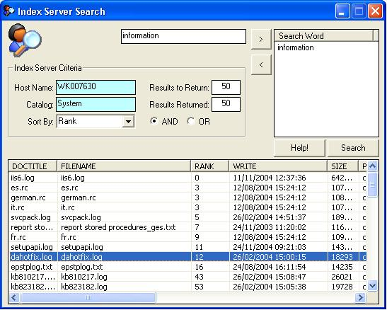



## Index Server via VB

### Description

Microsoft Indexing Service is a service that provides a means of quickly searching for files on a machine. The most familiar usage of the service is on web servers, where it provides the functionality behind site searches. It provides a straightforward way to index and search your web site or machine. This simple app. provides a way of accessing that functionality via VB.

My initial reason for looking at Index Server was so I could search for documents in a particular directory that I have set up. If you create your own Catalog and add certain Directory's (collectively the dir's. are called the 'Scope') to that Catalog, you can then specify which Catalog to search in. Handy if you have documents that need to be kept in separate folders etc. (see the Help file) Included is a handy ListView builder which only needs a recordset and the target ListView, and an Internet Explorer imbedded in a form used as the Help file. I hope you find all of this useful and if so (or if not!), please leave a rating and comments. Regards....
 
### More Info
 
Entry fields:

1. Host/Computer Name.

2. Catalog name you wish to search.

You will need to ensure that you have referenced and available;

1. Index Server Control Library.

2. Microsoft Internet controls (for the Help file)

3. ActiveX Data Objects (ADO) 2.7 - an older version should be OK.

I am using Windows XP and haven't tried on any other op. system.

A list of files will be returned that contain the search words that you have specified, from the Catalog that you have specified. You could open them up from there, but I have just shown a message box on Double Click.

Happy users and developers!

             |
---                |---
**Submitted On**   |2005-01-18 15:38:20
**By**             |[GazMan](https://github.com/Planet-Source-Code/PSCIndex/blob/master/ByAuthor/gazman.md)
**Level**          |Intermediate
**User Rating**    |4.8 (24 globes from 5 users)
**Compatibility**  |VB 6\.0
**Category**       |[Windows System Services](https://github.com/Planet-Source-Code/PSCIndex/blob/master/ByCategory/windows-system-services__1-35.md)
**World**          |[Visual Basic](https://github.com/Planet-Source-Code/PSCIndex/blob/master/ByWorld/visual-basic.md)
**Archive File**   |[Index\_Serv1841051182005\.zip](https://github.com/Planet-Source-Code/gazman-index-server-via-vb__1-58346/archive/master.zip)

